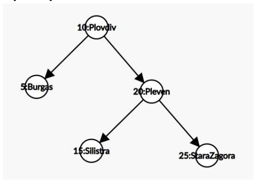

# FAQ

# Задача 1
## Kth Smallest Element in a BST

По даден корен на двоично наредено дърво и цяло число k, върнете k-тият най-малък елемент (броим от 1) от всички върхове на дървото.

**Example 1:**


```
Input: root = [3,1,4,null,2], k = 1
Output: 1
```
**Example 2:**


```
Input: root = [5,3,6,2,4,null,null,1], k = 3
Output: 3
 ```

**Constraints:**

- The number of nodes in the tree is n.
- 1 <= k <= n <= 10<sup4>4
- 0 <= Node.val <= 10<sup>4


## Задача 2
## Serialize and Deserialize BST
Сериализацията на структура от данни или обект представлява представянето му като поредица от битове (или символи), които да се пазят в буфер или да се предават по мрежата с цел предаване на (друга) програма и пресъздаването на съответната структура.

Нашата цел е да направим алгоритъм, който сериализира двоично дърво за търсене като го превърне в символен низ. Трябва също да можем да десериализираме дърво - по подадения низ да построим дърво.

**Example 1:**
```
Input: root = [2,1,3]
Output: [2,1,3]
```

**Example 2:**
```
Input: root = []
Output: []
```
 

**Constraints:**

- The number of nodes in the tree is in the range [0, 10<sup>4</sup>].
- 0 <= Node.val <= 10<sup>4
- The input tree is guaranteed to be a binary search tree.

## Задача 3
## Convert Sorted List to Binary Search Tree
По подадено начало на свързан списък, чиито елементи са възходящо подредени, постройте балансирано наредено двоично дърво за търсене.
**Example 1:**


```
Input: head = [-10,-3,0,5,9]
Output: [0,-3,9,-10,null,5]
Explanation: One possible answer is [0,-3,9,-10,null,5], which represents the shown height balanced BST.
```
**Example 2:**
```
Input: head = []
Output: []
```

**Constraints:**

- The number of nodes in head is in the range [0, 2 * 10<sup>5</sup>].
- -10<sup>5</sup> <= Node.val <= 10<sup>5</sup>

# Задача 4
## Search in a Binary Search Tree
По даден корен на двоично дърво за търсене и стойност на елемен от дървото, проверете дали елемента се съдържа в дървото. Измислете подходящо решение ако елементът не се съдържа в дървото.

**Example 1:**

```
Input: root = [4,2,7,1,3], val = 2
Output: [2,1,3]
```
**Example 2:**

```
Input: root = [4,2,7,1,3], val = 5
Output: []
```


**Constraints:**

- The number of nodes in the tree is in the range `[1, 5000]`.
- 1 <= Node.val <= 10<sup>7</sup>
- `root` is a binary search tree.
- 1 <= val <= 10<sup>7</sup>

# Задача 5
## Insert into a Binary Search Tree
По даден корен на наредено двоично дърво за търсене и число, поставете числото в дървото. Върнете корена на дървото след успешно поставяне. Предварително знаем, че даденото число не се съдържа вече в дървото. 

Забележете, че може да има няколко валидни начина за поставяне на елемента. Всеки от тях е верен отговор.

**Example 1:**


```
Input: root = [4,2,7,1,3], val = 5
Output: [4,2,7,1,3,5]
Explanation: Another accepted tree is:
```


**Example 2:**

```
Input: root = [40,20,60,10,30,50,70], val = 25
Output: [40,20,60,10,30,50,70,null,null,25]
```
**Example 3:**
```
Input: root = [4,2,7,1,3,null,null,null,null,null,null], val = 5
Output: [4,2,7,1,3,5]
```

**Constraints:**

- The number of nodes in the tree will be in the range [0, 10<sup>4</sup>].
- -10<sup>8</sup> <= Node.val <= 10<sup>8</sup>
- All the values Node.val are unique.
- -10<sup>8</sup> <= val <= 10<sup>8</sup>
- It's guaranteed that val does not exist in the original BST.

## Задача 6
## Delete Node in a BST
По даден корен на двоично дърво за търсене и ключ, изтрийте върха в дървото по подадения ключ. Върнете корена на дървото като резултат.

Изтриването може да се раздели на две стъпки:
- Намираме елемента за триене.
- Ако го намерим го изтриваме.
 

**Example 1:**

```
Input: root = [5,3,6,2,4,null,7], key = 3
Output: [5,4,6,2,null,null,7]
Explanation: Given key to delete is 3. So we find the node with value 3 and delete it.
One valid answer is [5,4,6,2,null,null,7], shown in the above BST.
Please notice that another valid answer is [5,2,6,null,4,null,7] and it's also accepted.
```


**Example 2:**
```
Input: root = [5,3,6,2,4,null,7], key = 0
Output: [5,3,6,2,4,null,7]
Explanation: The tree does not contain a node with value = 0.
```

**Example 3:**
```
Input: root = [], key = 0
Output: []
```

**Constraints:**

- The number of nodes in the tree is in the range [0, 10<sup>4</sup>].
- -10<sup>5</sup> <= Node.val <= 10<sup>5</sup>
- Each node has a unique value.
- root is a valid binary search tree.
- -10<sup>5</sup> <= key <= 10<sup>5</sup>
 

**Follow up:** Could you solve it with time complexity O(height of tree)?

# Задача 7
## Binary Search Tree Iterator
Implement the `BSTIterator` class that represents an iterator over the in-order traversal of a binary search tree (BST):

- BSTIterator(TreeNode root) Initializes an object of the BSTIterator class. The root of the BST is given as part of the constructor. The pointer should be initialized to a non-existent number smaller than any element in the BST.
- boolean hasNext() Returns true if there exists a number in the traversal to the right of the pointer, otherwise returns false.
- int next() Moves the pointer to the right, then returns the number at the pointer.

Notice that by initializing the pointer to a non-existent smallest number, the first call to next() will return the smallest element in the BST.

You may assume that next() calls will always be valid. That is, there will be at least a next number in the in-order traversal when next() is called.

```
class BSTIterator {
public:
    BSTIterator(TreeNode* root) {
        
    }
    
    int next() {
        
    }
    
    bool hasNext() {
        
    }
};
```
**Example 1:**
```
BSTIterator bSTIterator = new BSTIterator(root);
bSTIterator.next();    // return 3
bSTIterator.next();    // return 7
bSTIterator.hasNext(); // return True
bSTIterator.next();    // return 9
bSTIterator.hasNext(); // return True
bSTIterator.next();    // return 15
bSTIterator.hasNext(); // return True
bSTIterator.next();    // return 20
bSTIterator.hasNext(); // return False
```

# Задача 8
## Binary Search Tree Iterator II
Implement the BSTIterator class that represents an iterator over the in-order traversal of a binary search tree (BST):

- BSTIterator(TreeNode root) Initializes an object of the BSTIterator class. The root of the BST is given as part of the constructor. The pointer should be initialized to a non-existent number smaller than any element in the BST.
- boolean hasNext() Returns true if there exists a number in the traversal to the right of the pointer, otherwise returns false.
- int next() Moves the pointer to the right, then returns the number at the pointer.
- boolean hasPrev() Returns true if there exists a number in the traversal to the left of the pointer, otherwise returns false.
- int prev() Moves the pointer to the left, then returns the number at the pointer.

Notice that by initializing the pointer to a non-existent smallest number, the first call to next() will return the smallest element in the BST.

You may assume that `next()` and `prev()` calls will always be valid. That is, there will be at least a next/previous number in the in-order traversal when `next()`/`prev()` is called.

**Follow up:** Could you solve the problem without precalculating the values of the tree?


```
Input
["BSTIterator", "next", "next", "prev", "next", "hasNext", "next", "next", "next", "hasNext", "hasPrev", "prev", "prev"]
[[[7, 3, 15, null, null, 9, 20]], [null], [null], [null], [null], [null], [null], [null], [null], [null], [null], [null], [null]]
Output
[null, 3, 7, 3, 7, true, 9, 15, 20, false, true, 15, 9]

Explanation
// The underlined element is where the pointer currently is.
BSTIterator bSTIterator = new BSTIterator([7, 3, 15, null, null, 9, 20]); // state is   [3, 7, 9, 15, 20]
bSTIterator.next(); // state becomes [3, 7, 9, 15, 20], return 3
bSTIterator.next(); // state becomes [3, 7, 9, 15, 20], return 7
bSTIterator.prev(); // state becomes [3, 7, 9, 15, 20], return 3
bSTIterator.next(); // state becomes [3, 7, 9, 15, 20], return 7
bSTIterator.hasNext(); // return true
bSTIterator.next(); // state becomes [3, 7, 9, 15, 20], return 9
bSTIterator.next(); // state becomes [3, 7, 9, 15, 20], return 15
bSTIterator.next(); // state becomes [3, 7, 9, 15, 20], return 20
bSTIterator.hasNext(); // return false
bSTIterator.hasPrev(); // return true
bSTIterator.prev(); // state becomes [3, 7, 9, 15, 20], return 15
bSTIterator.prev(); // state becomes [3, 7, 9, 15, 20], return 9
```
# Клас BST
### За следващите задачи се иска да се създаде клас BST, който ще представлява двоично наредено дърво
Нашето дърво ще пази двойки ключ-стойност. Нека ключ и стойност бъдат генерични параметри. Наредбата ще бъде по ключове. При търсене търсим по ключ и намираме стойност.    
1. Създайте контруктор, който приема като аргумент сортиран масив от двойки ключ-стойност.
2. Метод prittyPrint(), който извежда дървото на екрана по подходящ начин.
3. Метод contains(T key), който проверява дали ключ key се съдържа в дървото.   
4. Метод height(), който намира височината на дървото.
5. Mетод get(T key), който по даден ключ връща стойносттна, която му отговаря
6. Метод put(T key, V value), поставя наредената двойка key-value в дървото на подходящото място.
7. Метод delete(T key), трие двойката ключ-стойност от дървото.
8. Метод serialize(std::ostream& out) за сериализация на дървото по следният начин (Scheme format):
- Празното дърво се представя като “()”
- Нека е дадено дървото t с корен x:y, ляво поддърво tL и дясно поддърво tR. Ако sL е
представянето в “Scheme format” на tL, a sR – на tR, то низът “(x:y sL sR)” е
представянето на дървото t, където “x”, “sL” и “sR” са съответните низове.
Пример: 



се представя като

(10:Plovdiv (20:Pleven (25:StaraZagora () ()) (15:Silistra () ())) (5:Burgas () ()))

9. Предикат isBST() за проверка. 
